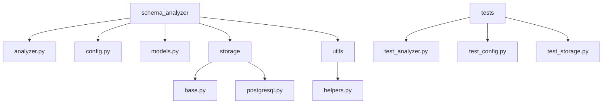

# Schema Evolution Analyzer

The Schema Evolution Analyzer is a powerful tool that helps you understand and manage changes in your database schema over time. It provides comprehensive insights into the impact of schema changes on existing queries and applications, making it easier to evolve your database schema with confidence.

## Features

- Analyze schema evolution patterns and detect potential issues
- Identify queries and applications affected by schema changes
- Suggest optimizations and modifications for impacted queries
- Integrate with your existing database change management process
- Comprehensive monitoring and logging for production environments
- Asynchronous analysis with concurrent processing for improved performance

## Installation

### pip Installation

You can install the Schema Evolution Analyzer using pip:

```bash
pip install schema-evolution-analyzer
```

### Local Installation

1. Clone the repository:

   ```bash
   git clone https://github.com/yourusername/schema-evolution-analyzer.git
   cd schema-evolution-analyzer
   ```

2. Create a virtual environment and activate it:

   ```bash
   python -m venv venv
   source venv/bin/activate
   ```

3. Install the required dependencies:

   ```bash
   make install
   ```

### Docker Installation

1. Clone the repository:

   ```bash
   git clone https://github.com/yourusername/schema-evolution-analyzer.git
   cd schema-evolution-analyzer
   ```

2. Build the Docker image:

   ```bash
   docker build -t schema-evolution-analyzer .
   ```

## Usage

### Command Line Interface

The Schema Evolution Analyzer provides a command-line interface for easy usage:

```bash
schema-evolution-analyzer --config config.yaml
```

### Python API

You can also use the Schema Evolution Analyzer programmatically in your Python code:

```python
from schema_analyzer import SchemaEvolutionAnalyzer, AnalyzerConfig

config = AnalyzerConfig.from_file("config.yaml")
analyzer = SchemaEvolutionAnalyzer(config)

result = analyzer.analyze_evolution(old_schema, new_schema)
print(result)
```

### Docker Usage

Run the Schema Evolution Analyzer using Docker:

```bash
docker run -v $(pwd)/config.yaml:/app/config.yaml schema-evolution-analyzer
```

## Configuration

The Schema Evolution Analyzer can be configured using a YAML configuration file. An example configuration file is provided in `config.example.yaml`. Copy this file to `config.yaml` and modify it according to your needs.

## Project Structure

```
schema-evolution-analyzer/
├── schema_analyzer/
│   ├── __init__.py
│   ├── analyzer.py
│   ├── config.py
│   ├── models.py
│   ├── storage/
│   │   ├── __init__.py
│   │   ├── base.py
│   │   └── postgresql.py
│   └── utils/
│       ├── __init__.py
│       └── helpers.py
├── tests/
│   ├── __init__.py
│   ├── test_analyzer.py
│   ├── test_config.py
│   └── test_storage.py
├── config.example.yaml
├── requirements.txt
├── Dockerfile
├── setup.py
├── Makefile
├── CONTRIBUTING.md
├── CHANGELOG.md
├── README.md
└── LICENSE
```



## Contributing

Contributions are welcome! Please see the [CONTRIBUTING.md](CONTRIBUTING.md) file for guidelines on how to contribute to this project.

## Testing

To run the test suite, use the following command:

```bash
make test
```

## License

This project is licensed under the MIT License. See the [LICENSE](LICENSE) file for details.

## Changelog

See the [CHANGELOG.md](CHANGELOG.md) file for a list of changes in each release.

## Support

If you encounter any issues or have questions, please open an issue on the GitHub repository.